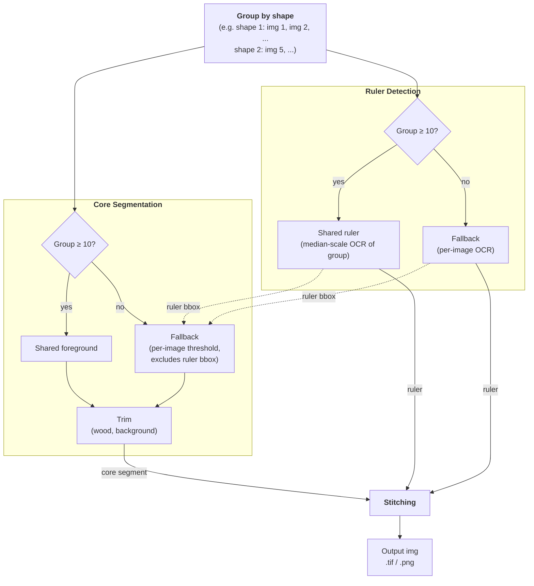

# Boreholes Photo Processor — Architecture

## Overview

This pipeline turns individual close-up photos of borehole core or cuttings segments into
composite "sheet" images for a borehole. It's built for batch processing across many
boreholes (folders) at once, run either locally or via CLI in a deployed environment, with
optional MLflow tracking. See [README.md](README.md) for installation, CLI usage, and the
expected input/output folder layout — this document covers *how the pipeline works
internally and why*.

Cores and cuttings are two independent pipelines (`cores`/`cuttings` CLI subcommands,
`main_cores()`/`main_cuttings()` in `src/run.py`), each backed by a `PipelineRunner`
subclass (`src/pipeline_runner.py`): `CorePipelineRunner` or `CuttingsPipelineRunner`. Both
share `PipelineRunner.run()` (single borehole folder) / `batch_run()` (root folder
containing one subfolder per borehole) — a template method that calls the subclass's
`_collect` → `_segment` → `_evaluate` (no-op for cuttings) → `_stitch` in order, then saves
the stitched pages. The two pipelines differ in segmentation approach and output layout
because they're photographed under very different physical setups: cores are
consistently-shaped rock cylinders in a wooden tray with a printed ruler, while cuttings
are loose rock fragments whose layout (tray, paper sheet, black circle) varies by
borehole.

All tunable parameters (segmentation thresholds, stitching layout, evaluation tolerances)
live in `src/config.py` / `src/evaluations/config.py`, loaded from `config.yaml`
(`PipelineConfig.from_yaml`) — there are no CLI flags for these, so a config file is the
single source of truth for a given run.

## Cores pipeline

### Data flow

`CorePipelineRunner`, in order:

1. **Collect** — scan the folder for `.tif` files, parse `ImageMetadataCores` (borehole ID
   + depth range) from each filename, skip unreadable/non-image files.
2. **Segment** (`src/segment/segment_cores.py`) — for each image, detect the core region,
   the wooden tray, and the depth ruler, producing `ImageMetadataProcessedCores`.
3. **Evaluate** (`src/evaluations/core.py`, only with `--mlflow`) — flag detections whose
   measured core length deviates too far from the batch median, and whose core width deviates
   too far from its depth segment's reference (segments found via `DPCoreWidthEstimation`), as
   a segmentation quality signal.
4. **Stitch** (`src/stitching/stitching_cores.py`) — group processed images into chunks of
   `num_cores_per_image`, resize each core to a shared physical scale, and compose them
   onto labeled canvases with rulers.

### Segmentation

The core detection problem is: given a raw photo of a tray with a core segment in it, find
the bounding box of just the rock (excluding the wooden tray, background, and printed
ruler). Both detectors follow the same shared-group-with-per-image-fallback pattern
(`ProcessGroupByShape` in `src/segment/utils/misc.py`): compute one aggregated result per
shape group when the group is large enough, otherwise detect each image in that group
independently. They are no longer fully independent, though: ruler detection runs first,
and its bbox is passed into the tray's per-image fallback so a candidate region overlapping
the ruler is never mistaken for the core.

**Tray/core region** (`ProcessTrayGroupByShape` + `segment_tray` in
`src/segment/utils/tray.py`, `segment_core` in `src/segment/utils/core.py`):

- Shape groups with at least `n_min_foreground` (default 10) images get one **shared**
  bbox: align each sampled image to a reference image via optical flow (displacement
  clipped by `max_flow_shift`) to correct for inter-shot drift, then stack the aligned
  images, take the per-pixel std (static background → low std, moving core → high std),
  and fit a 2-component GMM to isolate the foreground region.
  Smaller groups fall back to `segment_tray`, thresholding each image independently with
  an adaptive local threshold (`threshold_local`, more robust to uneven lighting than a
  single global threshold) + morphology, then dropping any candidate region that overlaps
  the detected ruler bbox — noisier than the shared path, but the only option without
  enough data.
- Either way, `segment_core` then trims wood (saturation) and black background
  (brightness) off all four sides. Fragmented cores are kept as separate `bbox_segments`;
  `bbox` is their union.

**Depth ruler** (`ProcessRulerGroupByShape` + `segment_ruler` in
`src/segment/utils/ruler.py`):

- Same grouping/fallback as the tray, using `n_min_ruler` (default 10). Each image:
  binarize, OCR the printed ticks with Tesseract, keep digits in a plausible range, and
  drop misreads via a neighbor-consensus check (each detection's count of step-consistent
  neighbors must itself be close to the group's median neighbor count).
- Groups above the threshold OCR a sample and keep the **median-by-scale** (`px_per_unit`)
  detection, reused for the whole group — more robust than trusting a single image's OCR.

Each image ends up with `core`, `tray`, and `ruler` results (any of which may be `None` if
detection failed for that image) — segmentation for one image never blocks the batch;
failures are logged and that image is dropped (`SegmentationError`). Both the shape-group
aggregation and the per-image fallback pass run in parallel worker pools sized by the same
`config.n_workers`.

### Stitching / Output

`src/stitching/stitching_cores.py` chunks the processed images into groups of
`num_cores_per_image` and, per chunk, produces one canvas image
(`stitching_batch`/`_draw_*` in `src/stitching/draw.py`):

- Each core crop is resized so that its ruler's `px_per_unit` maps to a shared canvas
  scale (`max_core_height / shared_ruler_steps`), so cores from different images end up at
  a consistent physical scale even though their pixel resolutions differ. Cores with no
  detected ruler fall back to the batch's median scale.
- `shared_ruler_steps` (major tick count) and the borehole ID are computed once across
  the *entire* borehole and reused for every chunk/canvas, so rulers and labels stay
  consistent across the multiple output sheets of one borehole.
- Landscape-oriented core crops are rotated 90° so depth increases top-to-bottom
  (`ImageMetadataProcessedCores.load_core`).
- Cores whose raw pixel dimensions are disproportionate to the rest of the batch are
  height/width-matched instead of scaled at their natural size (outlier handling in
  `_resize_images`).
- Each canvas is saved as both `.png` and `.tif` in the output directory, mirroring the
  input's folder structure (single borehole vs. one subfolder per borehole in batch mode).

## Cuttings pipeline

### Data flow

`CuttingsPipelineRunner`, in order:

1. **Collect** (`src/preprocessing/cuttings.py`, `collect_cuttings`) — scan the folder for
   image files (`.jpg`/`.jpeg`/`.bmp`/`.tif`/`.tiff`), parse a single point depth per
   filename into `ImageMetadataCuttings`, exclude sample-vial photos, and drop
   duplicate-depth images (keeping the first or last by filename, per the `dedup_keep`
   config setting).
2. **Segment** (`src/segment/segment_cuttings.py`) — crop the cuttings region using one of
   two interchangeable methods, selected via `--cut-type`, producing
   `ImageMetadataProcessedCuttings`.
3. *(No evaluation step yet — `_evaluate` is a no-op for this pipeline.)*
4. **Stitch** (`src/stitching/stitching_cuttings.py`) — arrange into fixed-size grid pages.

Unlike cores, cuttings filenames follow no single convention — different boreholes/labs
name files differently — so `ImageMetadataCuttings.from_path` tries six borehole-specific
regexes in turn (GEo-02's dash-separated numbers, IMG-trailing-depth, plain leading-depth,
the V1SM and Montagny prefixed forms, and a generic Forsthaus trailing-depth fallback) and
raises if none match. `borehole_id` isn't parsed from the filename at all — it's assigned
by the caller from the input folder name — since none of these conventions carry a
reliably-parseable id prefix.

### Segmentation

`segment_cuttings` dispatches each image to a segmenter (`src/segment/segment_cuttings.py`),
chosen once per run via `--cut-type` to match the physical layout used at that borehole:

- **`black_circle`** (default) — cuttings sit inside a black circular tray. Threshold on
  grayscale brightness, take the largest connected component, and crop a square around its
  centroid sized from its area. Purely per-image; there's no batch-wide consistency to
  exploit here (no common tray shape or fixed camera rig across a borehole's cuttings
  photos) and no ruler to coordinate with.
- **`pebble`** (`segment_pebble` in `src/segment/segment_cuttings.py`) — cuttings sit next to
  a printed reference paper sheet. Per-image, this thresholds HSV brightness/saturation
  (the paper is the one visually consistent thing to detect, since raw pebble texture varies
  too much) plus shape/edge filtering (extent, solidity, area, edge-anchoring), then crops
  everything left of the paper's left edge. Falls back to the full, uncropped image (tracked
  via `PaperDetectionStatus`) whenever no candidate passes those filters or the candidate is
  geometrically implausible (e.g. would crop away more than half the image), rather than
  risk a wrong crop.

  Per-image brightness thresholding is noisy in practice (misses real paper under exposure
  variance, or mistakes a bright pebble for the card). Where a borehole's photos share a
  camera setup closely enough to produce a large group of identically-shaped images
  (`ProcessPebblePaperGroupByShape`/`SegmentationCuttingsPebbleGroupConfig` in
  `src/segment/utils/cuttings.py`, mirroring cores' `tray_group`), the paper's position is
  instead estimated once per shape group and reused for every image in it, falling back to
  per-image detection only for images whose shape group is too small
  (`n_min_group`, default 10) to trust a shared estimate. The estimate is built from
  cross-image pixel statistics rather than brightness alone: averaging many same-shape
  images washes differing cuttings material into a formless blur, but the paper — sitting at
  the same pixel position in every shot — survives sharp, so the region with *low
  cross-image standard deviation* isolates it far more reliably than a per-frame brightness
  cutoff. Brightness/colorlessness on the mean image is layered on top only to reject other
  things that are also consistent across every shot but aren't paper (e.g. a fixed
  lens-vignette corner). The status/bbox decision logic (`resolve_paper_crop`) is shared
  between the per-image and group paths.
- **`tray`** (`segment_tray` in `src/segment/segment_cuttings.py`) — cuttings sit in an open
  tray on a table, so texture, not brightness, separates pile from background. Compute local
  edge-density (Scharr gradient, box-averaged) and Otsu-threshold it, keep the largest
  connected component (excluding a separate textured label tag), erode it slightly to trim
  the smoothed-edge halo, then take a quantile-trimmed bbox over the remaining mask.

Each segmenter returns one bbox per image; failures (`ValueError`/`OSError`/
`SegmentationError`) are logged and that image is dropped, same as cores. The per-image loop
itself isn't parallelized (`segment_cuttings` runs a plain loop) since per-image segmentation
is already cheap relative to the group-estimation step (which does use `n_workers`, like
cores' `tray_group`/`ruler` group steps).

### Stitching / Output

`src/stitching/stitching_cuttings.py` arranges all of a borehole's cuttings into pages of a
**fixed grid** (`num_cuttings_columns` × `num_cuttings_rows`), filled column-major (top to
bottom within a column, then the next column) — unlike cores, there's no shared physical
scale to preserve, so layout is purely grid-based:

- Portrait crops are rotated 90° to landscape, then each is scaled down (never up) to fit
  its grid cell while preserving aspect ratio, and left-aligned so every row's left margin
  is consistent.
- Each cell gets a depth annotation to its right; the top/bottom of each column additionally
  shows the depth of that column's first/last cutting as a border label.
- The borehole ID is drawn once per page, shared across all pages like the core pipeline's
  ID label.

## Assumptions & edge cases

- **Filename contract is load-bearing.** Cores require `_XXXX.XX-YYYY.YY` (depth range) in
  the filename; the borehole ID is inferred as everything before it. Cuttings require a
  depth parseable under one of six borehole-specific conventions (see Cuttings pipeline
  above); the borehole ID instead comes from the folder name. Files that don't match are
  skipped with a warning, not fatal to the whole batch.
- **Shape grouping assumes a static camera (cores), or at least a static paper position
  (cuttings' `pebble`), per batch of same-shaped images.** If two genuinely different
  camera setups happen to produce images of the same pixel dimensions, they'd incorrectly
  share a foreground/ruler/paper estimate. This is a deliberate trade-off — using
  filename/shape as a cheap proxy for "same rig" rather than requiring explicit camera
  metadata. Cuttings' `black_circle` has no equivalent assumption since it always segments
  per-image.
- **Cuttings' `--cut-type` must match the physical layout at that borehole** and is picked
  manually — there's no auto-detection. A wrong choice still produces a garbage crop for
  `black_circle`; `pebble` degrades to an uncropped fallback instead, but neither fails loudly
  enough to make the mismatch obvious (tracked in #75).
- **Only 3-channel (or RGBA-with-alpha-dropped) images are supported**; grayscale input
  raises `SegmentationError`. Cores load via `tifffile` rather than PIL specifically
  because raw scans may be 16-bit, which PIL handles less reliably (`src/utils.py`).
  Cuttings additionally accept `.jpg`/`.jpeg`/`.bmp` (no 16-bit concern there).
- **Downscaling before detection, not before output.** Segmentation and OCR run on
  downscaled copies of images (`downscale_factor` per detector) for speed; all resulting
  bounding boxes are scaled back up before being applied to full-resolution images for
  cropping/stitching.

<!-- arch-sync:metadata
generated-at: 2026-08-14
git-ref: a3f492d
covered-paths:
  - src/run.py
  - src/pipeline_runner.py
  - src/segment/
  - src/stitching/
  - src/preprocessing/
  - src/evaluations/
  - src/models.py
  - src/config.py
  - src/utils.py
  - src/mlflow_utils.py
-->
