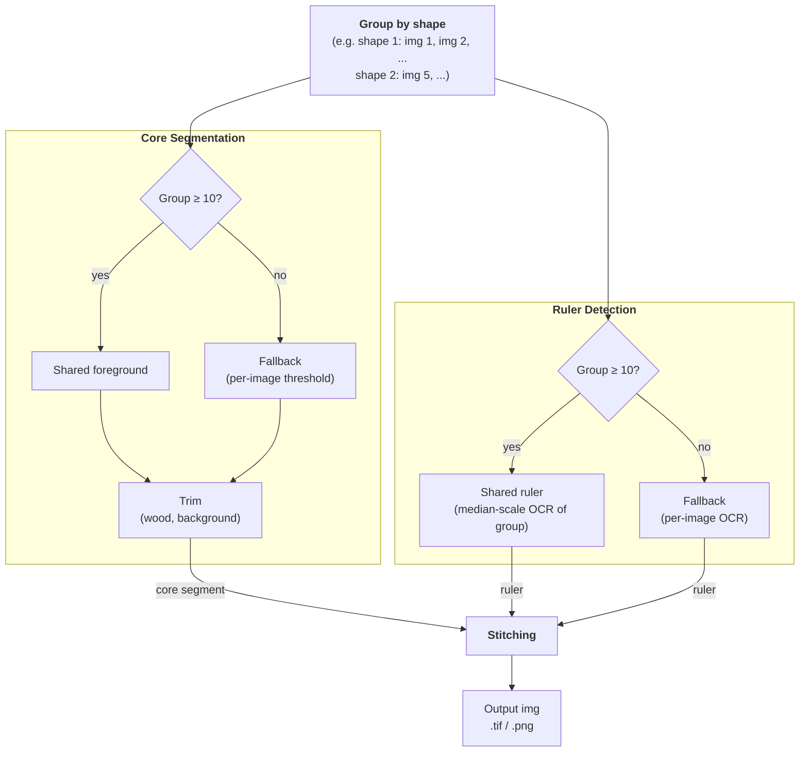

# Boreholes Photo Processor — Architecture

## Overview

This pipeline turns individual close-up photos of borehole core/cuttings segments into
composite "sheet" images: several core segments placed side by side on a black canvas,
flanked by a depth ruler, labeled with depth values and the borehole ID. It's built for
batch processing across many boreholes (folders) at once, run either locally or via CLI
in a deployed environment, with optional MLflow tracking. See [README.md](README.md) for
installation, CLI usage, and the expected input/output folder layout — this document
covers *how the pipeline works internally and why*.

## Data flow

Entry point: `src/run.py::main()` → `run()` (single borehole folder) or `batch_run()`
(root folder containing one subfolder per borehole).

For each borehole folder, `run()` does, in order:

1. **Scan** the folder for `.tif` files, parse `ImageMetadata` (borehole ID + depth range)
   from each filename, skip unreadable/non-image files (`src/run.py`).
2. **Segment** (`src/segment/segment.py`) — for each image, detect the core region, the
   wooden tray, and the depth ruler, producing `ImageMetadataProcessed`.
3. **Evaluate** (`src/evaluations/core.py`, only with `--mlflow`) — flag detections whose
   measured core width/length deviates too far from the batch median, as a segmentation
   quality signal.
4. **Stitch** (`src/stitching/stitching.py`) — group processed images into chunks of
   `num_cores_per_image`, resize each core to a shared physical scale, and compose them
   onto labeled canvases with rulers.

All tunable parameters (segmentation thresholds, stitching layout, evaluation tolerances)
live in `src/config.py` / `src/evaluations/config.py`, loaded from `config.yaml`
(`PipelineConfig.from_yaml`) — there are no CLI flags for these, so a config file is the
single source of truth for a given run.

## Segmentation

The core detection problem is: given a raw photo of a tray with a core/cuttings segment
in it, find the bounding box of just the rock (excluding the wooden tray, background, and
printed ruler). Two independent detectors run per image, and **both follow the same
shared-group-with-per-image-fallback pattern** (`ProcessGroupByShape` in
`src/segment/utils/misc.py`): compute one aggregated result per shape group when the group
is large enough, otherwise detect each image in that group independently.

**Tray/core region** (`ProcessTrayGroupByShape` + `segment_tray` in
`src/segment/utils/tray.py`, `segment_core` in `src/segment/utils/core.py`):

- Shape groups with at least `n_min_foreground` (default 10) images get one **shared**
  bbox: stack a sample of images, take the per-pixel std (static background → low std,
  moving core → high std), and fit a 2-component GMM to isolate the foreground region.
  Smaller groups fall back to `segment_tray`, thresholding each image independently
  (Otsu/triangle + morphology) — noisier, but the only option without enough data.
- Either way, `segment_core` then trims wood (saturation) and black background
  (brightness) off all four sides. Fragmented cores are kept as separate `bbox_segments`;
  `bbox` is their union.

**Depth ruler** (`ProcessRulerGroupByShape` + `segment_ruler` in
`src/segment/utils/ruler.py`):

- Same grouping/fallback as the tray, using `n_min_ruler` (default 10). Each image:
  binarize, OCR the printed ticks with Tesseract, keep digits in a plausible range, and
  drop misreads via the median spacing between consecutive numbers.
- Groups above the threshold OCR a sample and keep the **median-by-scale** (`px_per_unit`)
  detection, reused for the whole group — more robust than trusting a single image's OCR.

Each image ends up with independently-detected `core`, `tray`, and `ruler` results (any of
which may be `None` if detection failed for that image) — segmentation for one image never
blocks the batch; failures are logged and that image is dropped (`SegmentationError`). Both
the shape-group aggregation and the per-image fallback pass run in parallel worker pools
sized by the same `config.n_workers`.

## Stitching / Output

`src/stitching/stitching.py` chunks the processed images into groups of
`num_cores_per_image` and, per chunk, produces one canvas image
(`stitching_batch`/`_draw_*` in `src/stitching/draw.py`):

- Each core crop is resized so that its ruler's `px_per_unit` maps to a shared canvas
  scale (`max_core_height / shared_ruler_steps`), so cores from different images end up at
  a consistent physical scale even though their pixel resolutions differ. Cores with no
  detected ruler fall back to the batch's median scale.
- `shared_ruler_steps` (major tick count) and the borehole ID are computed once across
  the *entire* borehole and reused for every chunk/canvas, so rulers and labels stay
  consistent across the multiple output sheets of one borehole.
- Landscape-oriented core crops are rotated 90° so depth increases top-to-bottom
  (`ImageMetadataProcessed.load_core`).
- Cores whose raw pixel dimensions are disproportionate to the rest of the batch are
  height/width-matched instead of scaled at their natural size (outlier handling in
  `_resize_images`).
- Each canvas is saved as both `.png` and `.tif` in the output directory, mirroring the
  input's folder structure (single borehole vs. one subfolder per borehole in batch mode).

## Assumptions & edge cases

- **Filename contract is load-bearing.** Every image filename must contain
  `_XXXX.XX-YYYY.YY` (depth range); the borehole ID is inferred as everything before it.
  Files that don't match are skipped with a warning, not fatal to the whole batch.
- **Shape grouping assumes a static camera per batch of same-shaped images.** If two
  genuinely different camera setups happen to produce images of the same pixel
  dimensions, they'd incorrectly share a foreground/ruler estimate. This is a deliberate
  trade-off — using filename/shape as a cheap proxy for "same rig" rather than requiring
  explicit camera metadata.
- **Only 3-channel (or RGBA-with-alpha-dropped) TIFs are supported**; grayscale input
  raises `SegmentationError`. Loading uses `tifffile` rather than PIL specifically because
  raw scans may be 16-bit, which PIL handles less reliably (`src/utils.py`).
- **Downscaling before detection, not before output.** Segmentation and OCR run on
  downscaled copies of images (`downscale_factor` per detector) for speed; all resulting
  bounding boxes are scaled back up before being applied to full-resolution images for
  cropping/stitching.

<!-- arch-sync:metadata
generated-at: 2026-07-31
git-ref: f7c6da8
covered-paths:
  - src/run.py
  - src/segment/
  - src/stitching/
  - src/evaluations/
  - src/models.py
  - src/config.py
  - src/utils.py
  - src/mlflow_utils.py
-->
