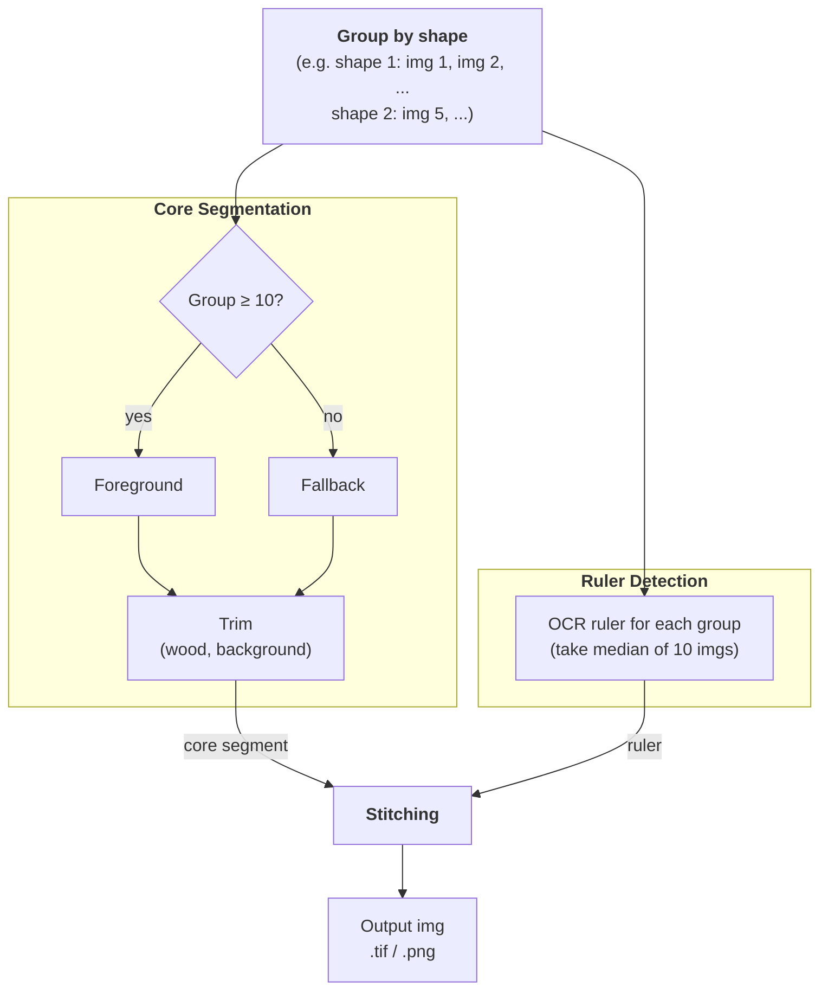

# Boreholes Photo Processor — Architecture

## Overview

This pipeline turns individual close-up photos of borehole core/cuttings segments into
composite "sheet" images: several core segments placed side by side on a black canvas,
flanked by a depth ruler, labeled with depth values and the borehole ID. It's built for
batch processing across many boreholes (folders) at once, run either locally or via CLI
in a deployed environment, with optional MLflow tracking. See [README.md](README.md) for
installation, CLI usage, and the expected input/output folder layout — this document
covers *how the pipeline works internally and why*.

## Data flow

Entry point: `src/run.py::main()` → `run()` (single borehole folder) or `batch_run()`
(root folder containing one subfolder per borehole).

For each borehole folder, `run()` does, in order:

1. **Scan** the folder for `.tif` files, parse `ImageMetadata` (borehole ID + depth range)
   from each filename, skip unreadable/non-image files (`src/run.py`).
2. **Segment** (`src/segment/segment.py`) — for each image, detect the core region, the
   wooden tray, and the depth ruler, producing `ImageMetadataProcessed`.
3. **Evaluate** (`src/evaluations/core.py`, only with `--mlflow`) — flag detections whose
   measured core width/length deviates too far from the batch median, as a segmentation
   quality signal.
4. **Stitch** (`src/stitching/stitching.py`) — group processed images into chunks of
   `num_cores_per_image`, resize each core to a shared physical scale, and compose them
   onto labeled canvases with rulers.

All tunable parameters (segmentation thresholds, stitching layout, evaluation tolerances)
live in `src/config.py` / `src/evaluations/config.py`, loaded from `config.yaml`
(`PipelineConfig.from_yaml`) — there are no CLI flags for these, so a config file is the
single source of truth for a given run.

## Segmentation

The core detection problem is: given a raw photo of a tray with a core/cuttings segment
in it, find the bounding box of just the rock (excluding the wooden tray, background, and
printed ruler). Two independent detectors run per image and combine:

**Tray/core region** (`segment_tray_by_group` / `segment_tray_single` +
`segment_core_from_tray` in `src/segment/utils.py`):

- Images are grouped by their on-disk pixel shape (`group_images_by_shape`) — images
  sharing a shape are assumed to come from the same static camera rig, so they also share
  roughly the same tray/background position.
- For each shape group with at least `n_min_foreground` (default 10) images,
  `segment_tray_multiple` estimates one **shared** bounding box for the whole group: it
  stacks a random sample of images, computes the per-pixel standard deviation across the
  stack (background pixels stay constant → low std; the core, which changes between
  shots, has high std), fits a 2-component Gaussian mixture over that std map, and takes
  the largest connected region above the high-mean component as the foreground. This is
  far more robust than per-image thresholding because it doesn't depend on that image's
  own lighting/contrast — it only needs the core to *look different* from the tray across
  the batch.
- Groups smaller than `n_min_foreground` fall back to `segment_tray_single`, which
  thresholds each image independently (Otsu/triangle threshold + morphological
  opening/closing) and picks the best candidate region by size/position heuristics
  (excludes regions touching the top edge, allows touching the bottom edge only if large
  enough, unions fragmented candidates). This fallback is inherently noisier per-image,
  which is why the shared-foreground path is preferred whenever there's enough data.
- Either way, the resulting tray/foreground bbox is then vertically trimmed by
  `segment_core_from_tray`, which finds the largest contiguous non-tray row interval based
  on HSV saturation (wood reads as high saturation, rock doesn't) — this removes the tray
  itself from the bounding box.

**Depth ruler** (`segment_ruler_by_group` / `segment_ruler` in `src/segment/utils.py`):

- Also computed once per shape group, for the same reason (static rig ⇒ shared ruler
  position and pixel-to-unit scale).
- Per image: binarize, run Tesseract OCR on the printed ruler tick numbers, keep digits
  within a plausible range, then use the median spacing between consecutive numbers to
  reject misread outliers.
- Rather than trusting a single image's OCR result, OCR runs on up to `n_min_ruler`
  images per group and the **median-by-scale** detection (by `px_per_unit`) is kept and
  reused for every image in the group. This exists specifically because a single-image
  detection was found to be too sensitive to per-image noise (lighting, thresholding) —
  see the "Aggregate ruler detection" fix in project history.

Each image ends up with independently-detected `core`, `tray`, and `ruler` results (any of
which may be `None` if detection failed for that image) — segmentation for one image never
blocks the batch; failures are logged and that image is dropped (`SegmentationError`).

## Evaluation (quality signal, not gating)

`src/evaluations/core.py` computes, per detection, a core **width** (bbox height in ruler
units) and a length-to-depth **ratio** (bbox width normalized by both the labeled depth
interval and the ruler scale), then flags entries whose relative deviation from the
batch's median exceeds a configurable tolerance (`CoreCheckConfig.relative_tolerance`).
This only runs when `--mlflow` is passed — it's a diagnostic for spotting bad
segmentations after the fact (logged as MLflow metrics/artifacts and an optional
`summary.csv` in batch mode), not something that alters segmentation or stitching output.
Checks are skipped (return `None`) when fewer than `min_samples` detections are available,
since a median over too few points isn't a reliable reference.

## Stitching / Output

`src/stitching/stitching.py` chunks the processed images into groups of
`num_cores_per_image` and, per chunk, produces one canvas image
(`stitching_batch`/`_draw_*` in `src/stitching/draw.py`):

- Each core crop is resized so that its ruler's `px_per_unit` maps to a shared canvas
  scale (`max_core_height / shared_ruler_steps`), so cores from different images end up at
  a consistent physical scale even though their pixel resolutions differ. Cores with no
  detected ruler fall back to the batch's median scale.
- `shared_ruler_steps` (major tick count) and the borehole ID are computed once across
  the *entire* borehole and reused for every chunk/canvas, so rulers and labels stay
  consistent across the multiple output sheets of one borehole.
- Landscape-oriented core crops are rotated 90° so depth increases top-to-bottom
  (`ImageMetadataProcessed.load_core`).
- Cores whose raw pixel dimensions are disproportionate to the rest of the batch are
  height/width-matched instead of scaled at their natural size (outlier handling in
  `_resize_images`).
- Each canvas is saved as both `.png` and `.tif` in the output directory, mirroring the
  input's folder structure (single borehole vs. one subfolder per borehole in batch mode).

## MLflow integration

`--mlflow` wraps each borehole folder's processing in an MLflow run (nested under the
batch's run in batch mode) and logs: per-image debug overlays (core/tray/ruler bboxes),
a segmentation approach summary (shared-foreground vs. per-image fallback, per image),
evaluation metrics/predictions, the stitched output images, the evaluation `summary.csv`
(batch mode only), and the run's log file. `summary.csv` is written to a throwaway temp
location and only exists as an MLflow artifact. The run's log file, by contrast, always
persists locally under `logs/` (gitignored) regardless of `--mlflow` — enabling `--mlflow`
additionally uploads a copy of it as an MLflow artifact once processing completes.

## Assumptions & edge cases

- **Filename contract is load-bearing.** Every image filename must contain
  `_XXXX.XX-YYYY.YY` (depth range); the borehole ID is inferred as everything before it.
  Files that don't match are skipped with a warning, not fatal to the whole batch.
- **Shape grouping assumes a static camera per batch of same-shaped images.** If two
  genuinely different camera setups happen to produce images of the same pixel
  dimensions, they'd incorrectly share a foreground/ruler estimate. This is a deliberate
  trade-off — using filename/shape as a cheap proxy for "same rig" rather than requiring
  explicit camera metadata.
- **Only 3-channel (or RGBA-with-alpha-dropped) TIFs are supported**; grayscale input
  raises `SegmentationError`. Loading uses `tifffile` rather than PIL specifically because
  raw scans may be 16-bit, which PIL handles less reliably (`src/utils.py`).
- **macOS AppleDouble sidecar files** (`._*.tif`, created when copying from certain
  filesystems) and **corrupt/unreadable TIFFs** are explicitly skipped during folder
  scanning — earlier versions of the pipeline crashed the entire batch run on either, so
  a single bad file no longer aborts a multi-hour run (see
  [issue #42](https://github.com/swisstopo/swissgeol-boreholes-photo-processor/issues/42)).
  Only fix once; any *other* unexpected exception during segmentation still surfaces to
  the caller rather than being silently swallowed.
- **`min_samples` thresholds exist because small-sample statistics are unreliable.** Both
  the evaluation checks and the shared-foreground/ruler estimation require a minimum
  number of images before trusting a median/aggregate — below that, they fall back
  (per-image segmentation) or skip (evaluation returns `None`) rather than report a
  possibly-noisy result.
- **Evaluation never blocks output.** Width/length checks are purely diagnostic
  (MLflow-only); a "failed" check does not exclude that core from the stitched output.
- **Downscaling before detection, not before output.** Segmentation and OCR run on
  downscaled copies of images (`downscale_factor` per detector) for speed; all resulting
  bounding boxes are scaled back up before being applied to full-resolution images for
  cropping/stitching.

<!-- arch-sync:metadata
generated-at: 2026-07-29
git-ref: 85ea769
covered-paths:
  - src/run.py
  - src/segment/
  - src/stitching/
  - src/evaluations/
  - src/models.py
  - src/config.py
  - src/utils.py
  - src/mlflow_utils.py
-->
